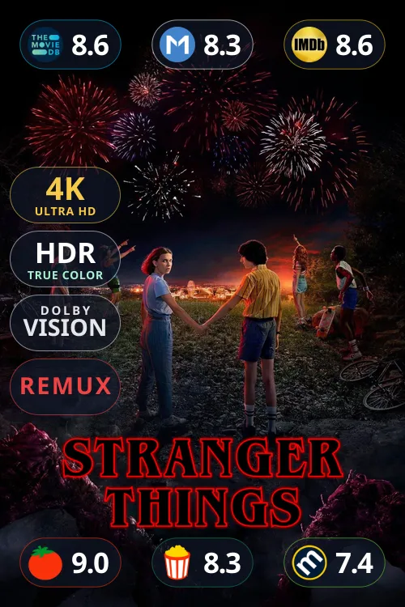
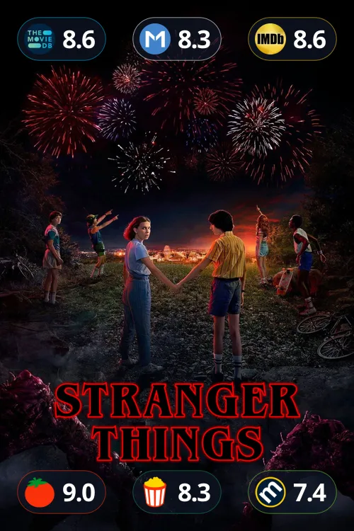
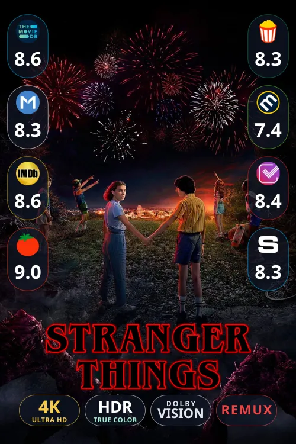
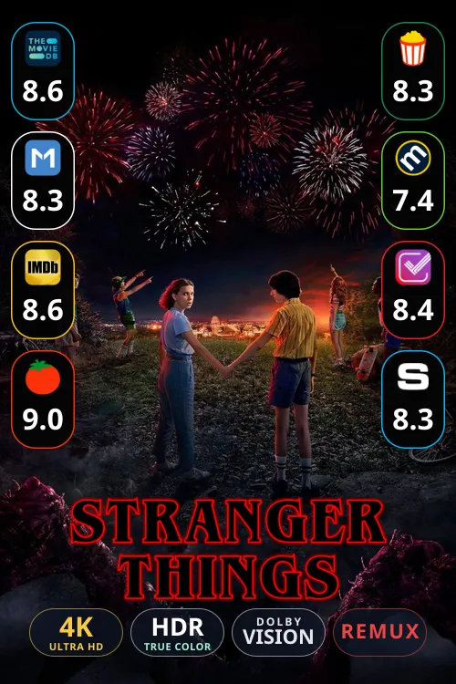
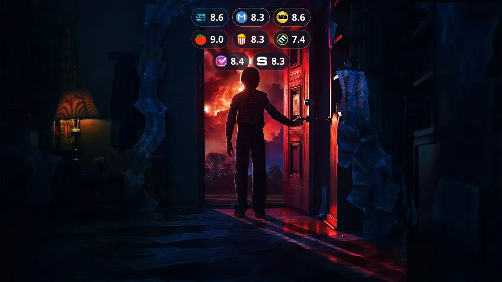
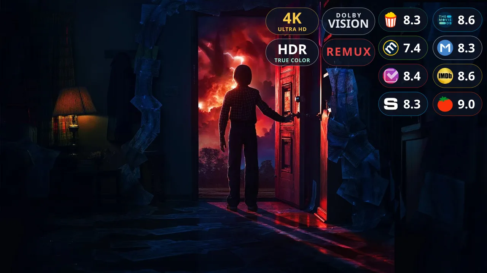
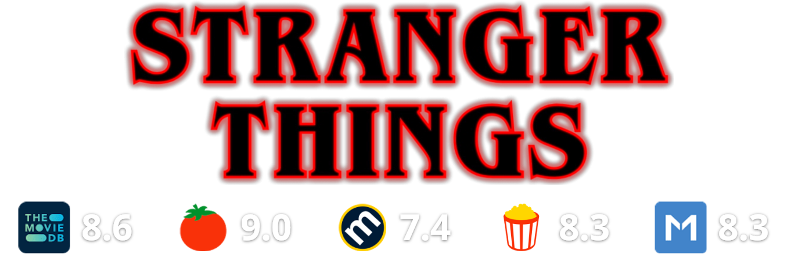
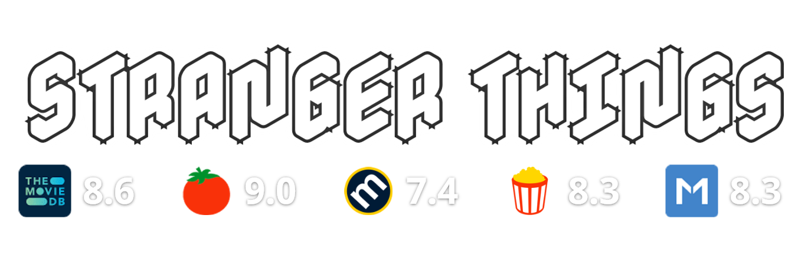
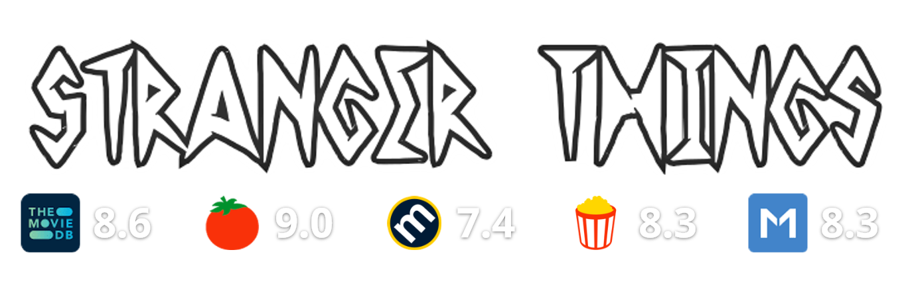

# Easy Ratings Database (ERDB) - Stateless Edition

ERDB generates poster/backdrop/logo/thumbnail images with dynamic ratings on-the-fly.

[](https://github.com/realbestia1/erdb/releases)
[](https://easyratingsdb.com/)
[](https://github.com/realbestia1/erdb/pkgs/container/erdb)
[](https://github.com/realbestia1/erdb/blob/main/LICENSE)

[](https://ko-fi.com/realbestia)

## Examples

### Posters

<table>
  <tr>
    <td width="50%"><strong>Poster 1</strong></td>
    <td width="50%"><strong>Poster 2</strong></td>
  </tr>
  <tr>
    <td></td>
    <td></td>
  </tr>
  <tr>
    <td width="50%"><strong>Poster 3</strong></td>
    <td width="50%"><strong>Poster 4</strong></td>
  </tr>
  <tr>
    <td></td>
    <td></td>
  </tr>
</table>

### Backdrops

<table>
  <tr>
    <td width="50%"><strong>Backdrop 1</strong></td>
    <td width="50%"><strong>Backdrop 2</strong></td>
  </tr>
  <tr>
    <td></td>
    <td></td>
  </tr>
  <tr>
    <td width="50%"><strong>Backdrop 3</strong></td>
    <td width="50%"><strong>Backdrop 4</strong></td>
  </tr>
  <tr>
    <td></td>
    <td></td>
  </tr>
</table>

### Logos

<table>
  <tr>
    <td width="100%"><strong>Logo</strong></td>
  </tr>
  <tr>
    <td></td>
  </tr>
</table>

### Custom Logos

<table>
  <tr>
    <td width="50%"><strong>Custom Logo 1</strong></td>
    <td width="50%"><strong>Custom Logo 2</strong></td>
  </tr>
  <tr>
    <td></td>
    <td></td>
  </tr>
</table>

### Thumbnails

<table>
  <tr>
    <td width="100%"><strong>Thumbnail</strong></td>
  </tr>
  <tr>
    <td></td>
  </tr>
</table>

<details>
<summary>Click to view Self-Hosting Instructions (Docker / Local)</summary>

## Quick Start

## Install From GitHub

```bash
git clone https://github.com/realbestia1/erdb
cd erdb
```

1. Install dependencies: `sudo npm install`
2. Build: `npm run build`
3. Start the app: `npm run start`
4. App available at `http://localhost:3000`

By default, `npm run start` now launches the standalone server in multi-process mode and uses all available CPU cores on the machine. You can override it with `ERDB_WORKERS=<n> npm run start`, or force single-process mode with `npm run start:single`.

## Docker

## Recommended Requirements

For high performance (on-the-fly image rendering), a server with a strong CPU and plenty of RAM is recommended.

Minimum recommended:
- CPU: 4 vCPU
- RAM: 4 GB

Basic start:
```bash
docker compose up -d --build
```

Docker now runs a single `app` container in multi-process mode. By default it uses `ERDB_WORKERS=auto`, so the container starts one worker per available CPU core. You can pin a fixed number with `ERDB_WORKERS=4 docker compose up -d --build`.

Run the published image directly:
```bash
docker pull ghcr.io/realbestia1/erdb:latest
docker run -d \
  --name erdb \
  -p 3000:3000 \
  -v ./data:/app/data \
  ghcr.io/realbestia1/erdb:latest
```

Update the published image:
```bash
docker pull ghcr.io/realbestia1/erdb:latest
docker stop erdb
docker rm erdb
docker run -d \
  --name erdb \
  -p 3000:3000 \
  -v ./data:/app/data \
  ghcr.io/realbestia1/erdb:latest
```

The public port is `ERDB_HTTP_PORT` (default `3000`) exposed directly by the `app` container. Set it in the `.env` file.
Data (SQLite database and image cache) is persisted in `./data`.

Custom port:
```bash
ERDB_HTTP_PORT=4000 docker compose up -d --build
```

## CI Docker Image

The repository includes a GitHub Actions workflow at [`.github/workflows/docker-image.yml`](/c:/Users/Bestia/Desktop/erdb/.github/workflows/docker-image.yml).

- On pull requests, it verifies that the Docker image builds successfully.
- On pushes to `main`, it builds and publishes the image to `ghcr.io/<owner>/<repo>`.
- On tags like `v1.0.0`, it also publishes a versioned image tag.
</details>

## API & Configuration

**Full documentation, interactive API builder, and Addon generator are available on our official website:**

[👉 **easyratingsdb.com**](https://easyratingsdb.com/)

Please configure your instance and obtain the `erdbConfig` payload directly from the website.
Our interactive configuration tool provides the easiest way to generate the required base64url configurations for Addon Developers.

---
---

## Addon Proxy (Stremio)

ERDB can act as a proxy for a Stremio addon and rewrite supported artwork with ERDB-generated
posters, backdrops, logos, and thumbnails.

### Manifest Proxy (Stremio)

Generate the proxy manifest URL from the ERDB website in the `Addon Proxy` section.
The generated URL is token-based and does not use query parameters.

```text
https://YOUR_ERDB_HOST/proxy/{token}/{config}/manifest.json
```

`{token}` is your ERDB token.
`{config}` is generated automatically by the site from the source addon manifest and the selected proxy options.

### How To Use

1. Open the ERDB website and sign in with your token.
2. Go to the `Addon Proxy` section.
3. Paste the original addon `manifest.json` URL.
4. Configure the image types and proxy options you want.
5. Copy the generated proxy manifest URL.
6. Install that URL in Stremio.

### Notes
- The proxy can rewrite `meta.poster`, `meta.background`, `meta.logo`, and `meta.videos[].thumbnail`.
- The enabled image types can be toggled in the `Addon Proxy` UI.
- The source URL must point to the original addon `manifest.json`.
- With token-based URLs, your saved ERDB configuration is resolved server-side.
- API keys and rendering settings are usually taken from the token configuration created in the workspace.

© 2026 ERDB Project

